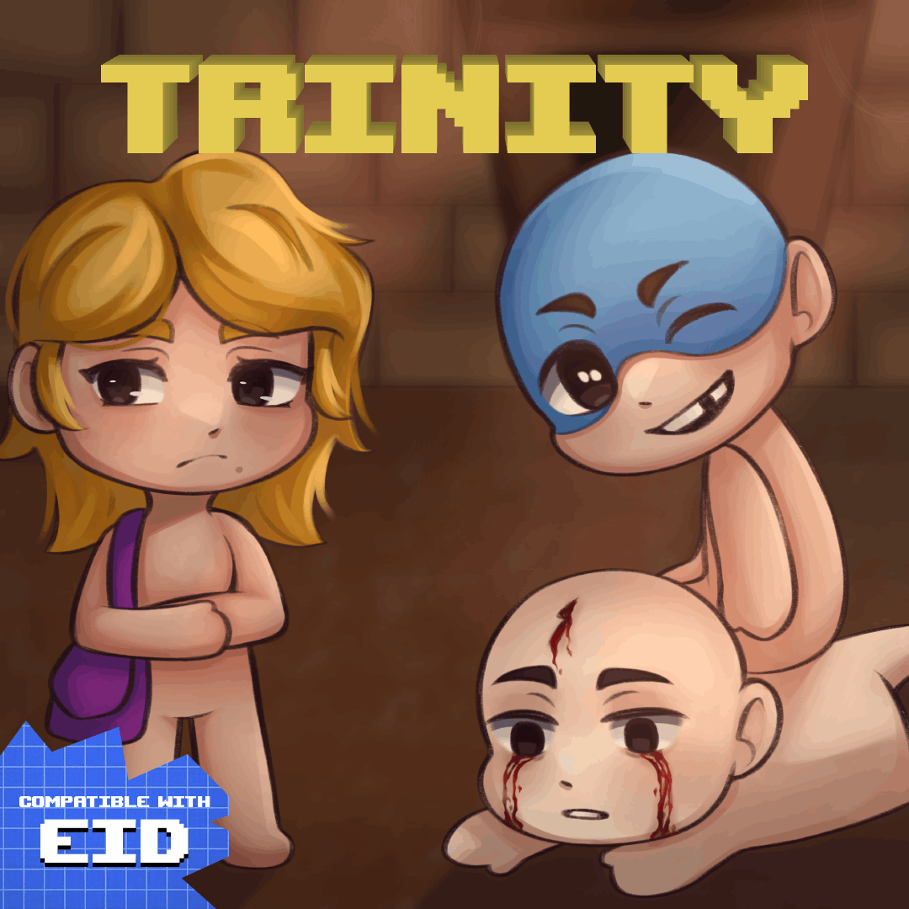

# 🩸 The Binding Of Isaac: Trinity

-red?style=for-the-badge)

Bem-vindo ao repositório oficial do mod! Este mod expande o conteúdo de *The Binding of Isaac: Repentance* adicionando novos personagens jogáveis, itens ativos, passivos e trinkets!

---

## 📸 Logo do Mod
> 

---

## 👥 Novos Personagens Jogáveis

Cada personagem traz um estilo de jogo totalmente novo e atributos únicos.

| Personagem | Status Iniciais / Itens | Descrição / Mecânica Principal |
| :---: | :--- | :--- |
| **Mary** | *Vida:* 2   *Velocidade:* 1 *Dano:* 1 | *Focada na utilização de Trinkets, Mary pode carregar dois trinkets ao mesmo tempo, além de melhorar a usabilidade dos trinkets que segura.* |
| **Peter** | *Vida:* 2   *Velocidade:* 1 *Dano:* 2 | *Pode alterar a prioridade de perda de corações (corações vermelhos antes de corações pretos ou de alma). Isso não faz com que as chances de pacto ou sala de anjo diminuam. Quanto mais corações vermelhos vazios Peter tiver, mais dano ele causa.* |
| **Isaiah** | *Vida:* 1   *Velocidade:* 2 *Dano:* 1 | *Pode gerar cartas de tarô. Utilizar cartas ou runas aumenta seu dano de forma cumulativa, mas todo bônus é perdido ao perder vida.* |

---

## 🔮 Novos Itens

### 🟥 Itens Ativos

* **🪞 Espelho de Corações**
    * *Tempo de Recarga:* `5 Salas`
    * *Efeito:* Inverte a prioridade de perda de corações até o fim do andar.
* **💻 Notebook Hacker**
    * *Tempo de Recarga:* `12 Salas`
    * *Efeito:* Spawna um item que não apareceria na sala em que o Notebook foi usado.
* **♟️ Tabuleiro de Xadrez**
    * *Tempo de Recarga:* `8 Salas`
    * *Efeito:* Pode dobrar o dano e diminuir a taxa de disparo ou dobrar a taxa de disparo e diminuir o dano.

### 🟦 Itens Passivos

* **🍀 Trevo d4 Folhas**
    * *Efeito:* Concede +4 de Sorte. Se tiver um item passivo categoria 0, o remove e spawna um novo item aleatório.
* **🔪 Faca de Papel**
    * *Efeito:* Aumenta o seu dano sempre que utilizar uma carta de tarô ou uma runa. Este bônus é reiniciado se receber dano.
* **🛞 Pneu Careca**
    * *Efeito:* Aumenta em 0.2 a velocidade. Sua velocidade não pode mais ser reduzida, independentemente da fonte.

### 🪙 Trinkets

* **💳 Cartão de Crédito Velho**
    * *Efeito:* Aumenta suas moedas em 10% sempre que ganhar carga para seu item ativo.
* **📔 Desenho da Maggie**
    * *Efeito:* Não faz nada... **aparentemente.**
* **🧯 Corta-fogo**
    * *Efeito:* Apaga todas as fogueiras automaticamente, incluindo fogueiras azuis e roxas.

---

## 🛠️ Instalação

### Opção 1: Pelo GitHub (Instalação Manual)
1. Baixe o código do repositório clicando em **Code > Download ZIP**.
2. Extraia o conteúdo do arquivo `.zip`.
3. Copie a pasta extraída e cole no diretório de mods do Isaac. Geralmente fica em:
   `C:\Program Files (x86)\Steam\steamapps\common\The Binding of Isaac Rebirth\mods`
4. Ative o mod no menu de Mods dentro do próprio jogo.

### Opção 2: Pela Oficina Steam (Recomendado)
* [Clique aqui para acessar a página do mod na Steam Workshop](https://steamcommunity.com/sharedfiles/filedetails/?id=3557892755) e clique em **Inscrever-se**.

---

## 🎨 Créditos & Agradecimentos

Este mod não seria possível sem o talento incrível dos seguintes artistas:

* **Arte de Capa:** [@luh_artwork](https://www.instagram.com/luh_artwork) (Instagram)
* **Arte de Personagens Caídos (Boss Screen / Co-op):** [ArtMocha](https://steamcommunity.com/profiles/76561198284588987) (Steam)
* **Programação e Design:** [Summer Vanntower](https://steamcommunity.com/id/Cosmic_Atlas/) (Steam)

---

## 🤝 Contribuição e Feedback

Encontrou um bug ou tem uma sugestão de balanceamento?
* Abra uma **Issue** detalhando o problema.
* Sinta-se livre para enviar um **Pull Request** com melhorias de código.

---

  <b>Feito com ❤️ no Brasil 🇧🇷</b>

